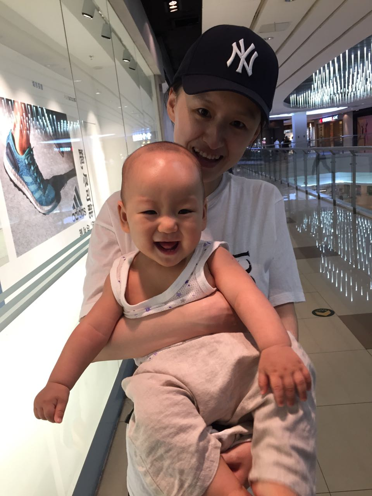

# 关于儿子的随笔

　　“可乐”是儿子的乳名，因为在爱人怀他的时候特别喜欢喝可乐，于是他便有了这么一个有趣的名字。我不会写像上一代一样只认为自己的孩子很优秀，却会像上一代一样认为自己的孩子很可爱。

　　从他生下来还只能用哭来表达一切，到现在可以一个人晃晃悠悠的走路，这让我只能叹息时间过的太快，我还来不及反应他都已经1岁了。所以我也不会像上一代人一样希望自己的儿女赶快长大，我更希望能够慢慢的陪伴他成长，和他一起经历全部童年。

　　孩子真的很简单，谁陪他玩他就会对谁产生依赖。在2017年元旦的3天假期，我难得没有其他安排，完完整整的陪了可乐3天。在那之后每天下班到家他都会主动向我索抱，还有一段时间只能让我抱着他才能睡觉，因此还特意请了一周的假陪他。对我来说没有什么能比家人的需要更重要的事情，也让我拥有被需要的满足感。

　　随着可乐的长大，慢慢戒掉了抱睡，又因为工作的原因，陪他的时间减少，他开始不再那么依赖我，就好像后宫失了宠的王妃，总渴望重新上位却越来越难。

　　孩子生病对于父母来说总是很揪心。这两天天气变化，可乐得了感冒，幸运的是并不严重，但因为总是流着两行鼻涕很难入睡，尤其是晚上。在爱人都束手无策的时候，可乐竟然在我的怀里睡着了。

　　今天就写这么多，希望他的感冒可以赶快好起来。