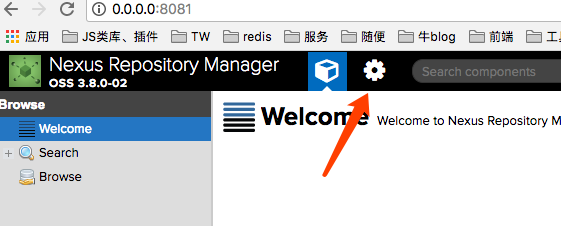
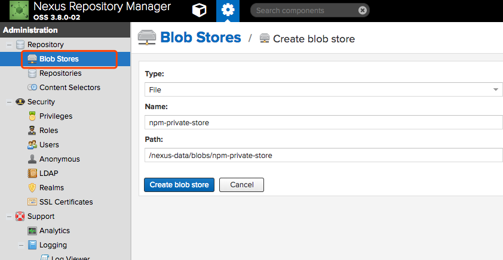
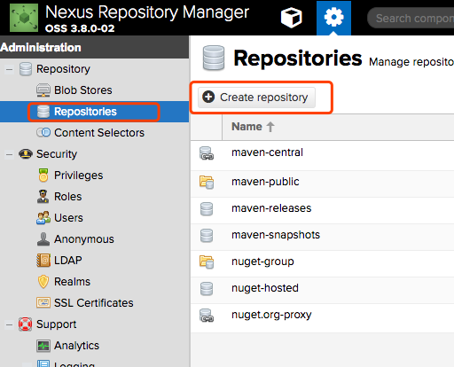
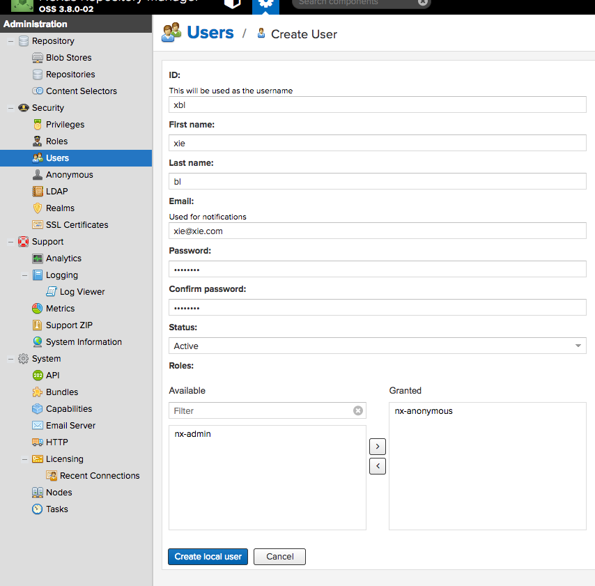
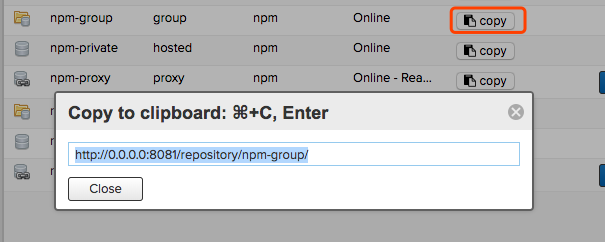

　　在前端/Nodejs 开发中我们通常会开发出公共的 module，但在企业开发功能模块时并不希望将自己的核心代码发布到 [npmjs.org](https://www.npmjs.com/) 中，虽然 npmjs.org 提供了私有的方法，更多企业还是倾向将代码控制在内网环境中，今天我们来介绍一下npm 私有模块的3种方法。


## 方法一：git + npm link

　　先来看一下[npm install 文档](https://docs.npmjs.com/cli/install)。 npm 支持安装 git 仓库，支持  `git` ,  `git+ssh` ,  `git+http` ,  `git+https` , or `git+file` 几种协议，例如：

``` shell
npm install git+<https://xxx.com/private-package.git>
```

这样会安装这个仓库的最新版本，如果需要指定版本依赖可以使用 git 的 Tag 来控制。

#### 使用 Tag 控制版本

```shell
npm install git+https://xxx.com/private-package.git#v1.0.0
```


#### npm link 的使用

很多时候我们需要修改 private-package 模块，但又不想每次先提交git，再执行 `npm install` 命令来看效果，这样效率太低也太麻烦，`npm link ` 可以帮助我们很方便的实现这样的功能。

来看一下如何使用：

``` shell
# clone 私有包
git clone https://xxx.com/private-package.git
# 进入私有包目录
cd private-package
# 创建全局的link
npm link

# 进入项目目录
cd ../project/abc
# 将private-package link 到项目
npm link private-package

# 取消link 
npm unlink private-package
```

也可以直接进入项目目录

```shell
cd ~/project/abc
# link 相对路径的 private-package
npm link ../private-package

# 取消相对路径的 private-package
npm unlink ../private-package
```

这种方式成本最低，试用于规模比较小的团队，无需搭建私服，只要 git 仓库就可以搞定。


## 方法二：CNPM 私服

　　[cnpm](https://github.com/cnpm/cnpmjs.org) 是国内 IT 大厂淘宝开发的包管理工具，大多数的同学应该都用 cnpm 的客户端命令，其实 cnpm 还有一个很重要的功能，就是搭建私服。

这里偷个懒，只介绍使用 docker-componse 来搭建私服：

```shell
# clone
git clone https://github.com/cnpm/cnpmjs.org.git
# 进入目录
cd cnpmjs.org
```

##### 修改 ./docs/dockerize/config.js 配置

有3个配置是值得我们注意的：

```json
// 默认是 false，在同一个局域网里任何用户都可以publish，为 true 时只有管理员才可以publish，不过没有其他网络环境，没测试过
enablePrivate: false,

// 发布的私有模块必须指定scope，不能是全局的模块，所有这里我们可以添加自己公司的scope，如：@xbl
scopes: [ '@cnpm', '@cnpmtest', '@cnpm-test', '@xbl' ],

// 这里我们可以写一些全局的私有模块名称，为了之前我们可能使用过git的方式
privatePackages: [],
```

cnpm 更推荐使用 [@scope](https://docs.npmjs.com/misc/scope) 的方式，也可以避免与公共包重名的情况。

修改好之后在目录下执行下面命令：

```shell
# 启动服务
docker-compose up -d
```

此时会暴露出两个端口，web 地址为 http://127.0.0.1:7002/ ，提交模块的地址为 http://127.0.0.1:7001

##### 停止服务


```shell
# 停止服务
docker-componse down 

# 停止服务并不会删除将数据删除，如果有测试需要可以执行如下命令：
# 停止服务同时删除容器中挂载的卷数据
docker-componse down -v 
```


#### 编写私有模块

为了方便我们可以在自己的项目中添加 `.npmrc` 文件

```shell
registry=http://localhost:7001/
# 或者指定 scope 才走私服
@xbl:registry=http://localhost:7001/
```

修改私有模块的package.json，添加scope

```shell
{
  "name": "@xbl/private-package",
  "version": "1.0.0",
  "description": "private",
  "main": "index.js",
  ...
}

```

然后执行

```shell
# 登录，在同一个局域网内随便写用户名、密码...
npm adduser
# 发布模块
npm publish
```

#### 使用私有模块

在项目中添加 `.npmrc` 文件，与前面写法一致。

执行安装命令：

```shell
npm install @xbl/private-package
```

#### 总结

　　这种方式更适合更大规模的团队，需要占用服务器资源，有些公司可能还需要 DevOps 同事的支持。因为是自己的私服，安装模块可以不走公网，只走公司内网，安装模块的速度会更快。


参考：

https://www.zybuluo.com/chris-ren/note/435419

https://segmentfault.com/a/1190000005946580

## 方法三：Nexus 私服

　　最后要说的这个就厉害了，[Nexus](https://www.sonatype.com/nexus-repository-oss) 大家应该知道是对 Maven 包管理的私服工具，其实他还支持 npm 、docker 、yum 等等。

#### 安装

同样使用 docker 启动服务：

```shell
docker run -d --restart=unless-stopped  --name nexus \
-p 8081:8081 -p 5000:5000 -p 5001:5001 -p 5002:5002 -p 5003:5003 -p 5004:5004 \
--ulimit nofile=90000:90000 \
-v /你的磁盘绝对路径:/nexus-data \
-e INSTALL4J_ADD_VM_PARAMS="-Xms2g -Xmx2g" \
sonatype/nexus3:3.8.0
```

启动需要等待一小会，服务启动后访问：http://127.0.0.1:8081/

停止服务：

``` shell
docker stop nexus
# 再次启动
docker start nexus
```

#### 登录

默认使用的用户名密码是： `admin/admin123`

#### 配置

登录之后点击【配置】：



###### 创建存储



###### 创建Repositories



###### 创建 npm Repositories


这里可以看到3个npm…难道是他们兄弟多吗？这里需要解释一下

* npm (proxy) 看名字就知道是代理仓库
* npm (hosted) 是私有仓库
* npm (group) 是组合前面两个，最终暴露出的

###### 创建代理仓库


需要填的就3个字段

**Name**: 仓库的名字

**Remote storage**: 远程仓库地址，例如：https://registry.npmjs.org 或者使用淘宝的：https://registry.npm.taobao.org

**Blob store**：选择我们刚刚创建好的存储

###### 创建 npm (hosted) 仓库


###### 创建npm (group) 仓库


这里值得注意的是 Members 的顺序，会优先选择我们的 npm-private ,然后再走proxy，即便是重名也会优先下载私服的模块。

#### 创建用户



#### 配置 .npmrc 文件



复制这个 url 到**.npmrc** 文件

```shell
registry=http://localhost:8081/repository/npm-group/
```

#### 修改私有模块的 package.json

```Json
{
  "name": "private-package",
  "version": "1.0.0",
  ...
  "publishConfig": {
    "registry": "http://localhost:8081/repository/npm-private/"
  },
  ...
}
```

要注意这里的 `publishConfig` 填写的是 npm (hosted) 的仓库地址。接下来我们正常执行发布流程就 ok 了！

#### 小技巧

因为每次执行 `npm adduser` 的时候都需要输入用户名、密码和email 很麻烦，我们都可以配置在.npmrc 文件中，在命令行中执行如下脚本：

```shell
echo -n 'myuser:mypassword' | openssl base64
```

会得到一个 base64 的字符串

**修改 .npmrc** 

```shell
registry=http://0.0.0.0:8081/repository/npm-group/
_auth=YmFvYmFvOmJhb2Jhbw==
email=xie@xie.com
```

---

　　这种方式更适应于比较大的团队，支持全局私有包和 @scope 多种方式，使用起来会更加自由。而且不仅适用于前端团队，后端同学甚至 DevOps 都可以共用 Nexus 服务。

参考：https://blog.sonatype.com/using-nexus-3-as-your-repository-part-2-npm-packages

## 总结

　　今天为大家介绍了3种主流的 npm 私有包使用方法，大家可以根据团队的情况自行选择，没有最好的方案，只有最适合。欢迎大家批评指正，谢谢！