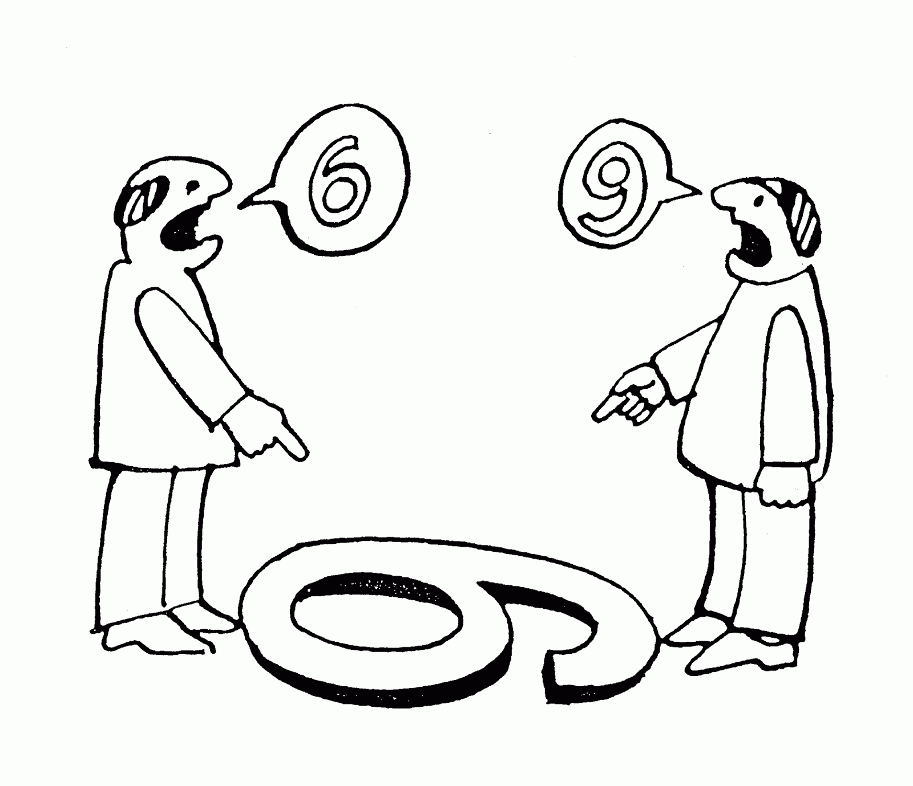

　　在开始之前我们先来看一段视频：

　　真惨是吧！有同学认识他吗？视频的主人公叫尼克.胡哲，生下来就没有四肢，曾经在10岁的时候想过把自己淹死在浴缸里，那是什么使他的人生出现改变的呢——**演讲**。那作为四肢健全的我们是不是也应该学习演讲呢？谁还没有个万一呢！

　　*我就喜欢看你们笑，说明大家都有这个需求哈！*

　　他通过演讲——**影响他人做出积极的改变！**	

那么问题来了，我们应该如何做好一场演讲呢？我们今天从

* 演讲前
* 演讲中
* 演讲后

这三个阶段来分享一下如何做一场演讲，覆盖的内容呢主要偏演讲技巧，而不涉及到演讲的内容和 PPT 的设计，为什么没设计内容这部分呢，主要是我也不会。

## 演讲前

　　在我们要做准备演讲之前我们最先要关注是什么问题呢？

　　——**听众是谁**

　　有些同学在做演讲之前首先不知道讲什么，对吧，即便确定了讲什么又不知道应该讲道什么程度，这是为什么呢？是因为我们不了解**听众是谁**，就好比创业但又不知道做什么项目，如果当你知道有一个岛上的人们从来没穿过鞋，你是不是就知道应该做什么项目了呢。当我们了解了听众是谁，就可以设定一个演讲的主题与范围了。

　　*在一些公开课的时候我们都会看到有一栏适应人群，目的就是限制演讲内容的范围，呈现最好的效果。*

　　还应该关心什么呢？

　　——**听众的需求是什么**

　　就像这次分享之前我都会问一下大家，在这次分享中希望得到哪些收获，这就是在确定用户需求。拿到用户的需求再设计我们演讲的内容以及深度就更容易了。有了明确的需求我们就可以进入准备阶段了。

### 准备阶段

* 准备主题
* 设计主干
* 编写讲稿
* 设计PPT
* 准备仪表

#### 编写讲稿

　　因为这次分享的内容主要是演讲技巧，所以这里就不展开讲这些了。值得一提的是**编写讲稿**，并不是所有的人都愿意去编写讲稿，可能觉得临场发挥的效果会更好。编写讲稿并不是让我们照本宣科，而是帮助我们理清思路，以及要演讲中的要点、故事记录。在演讲时词语上仍然可以临场发挥。另一个好处是帮助我们控制时间，我们将讲稿写完之后进行排练，我们可以得到一个相对准确的时间，不会因为临时起意想到一个故事而超时。还有一个好处在我们后面分享。

　　*无论写不写讲稿都要将演讲的内容烂熟于心，而不是照着PPT去念。*

#### 准备仪表

　　关于仪表也有一点建议，大家比较了解我，我平时就穿成这样，其实如果是给外部做演讲还好，如果是做培训就不是很合适，为什么呢？无论是培训还是演讲都要与听众建立情感的连接，我穿成这样距离感太强了。那什么样的穿着才是合适的呢，就是只比听众正式一点点。如果穿的没有差异，很难从人群中看出谁是讲师。

　　还有是在上台前不要有太多装饰，如果你的装饰太多，听众会因为这些东西而分散注意力，影响演讲的效果。

​	上台后我们要表现的**激情、自信、放松**。

### 处理紧张

　　在上台前很多同学都会紧张，感觉心脏都快跳出来了，包括我自己。那我们为什么会紧张呢？

#### 为什么会紧张？

* 怕出错
* 会觉得自己很傻
* 怕被别人 Challenge
* 没有安全感
* 环境陌生
* 等等...

　　有无数个原因会让我们感到紧张，我们应该消除紧张吗？

#### 处理紧张的方法

* **接纳**——紧张是正常的，我们并不需要消除紧张情绪，我们要做的是接纳，就像凤姐接纳了自己长的不完美一样。我就是紧张怎么了，只要别影响演讲的发挥，带一些紧张的情绪会让演讲的效果更好，反而你站在人们面前一点都不紧张，一场演讲的效果就很差。说的容易，当我紧张的时候脑子里一片空白，怎么可能不影响发挥呢？这里有一个**诀窍**分销给大家——牢记**讲稿**前面3句话，后面的内容自然而然的就出来了。
* **压制**——刻意练习压制住紧张。
* **暗示**——正向的暗示，我们都看过赵本山的小品——《我想有个家》，黄小娟在台上特别紧张，就暗示自己 “我不紧张，我不紧张”，一开口 “我叫不紧张”。虽然也使用了暗示，但暗示的方式不对，我们要从正向的角度去暗示，比如：“我很放松，我很放松”。
* **隐藏**——对听众隐藏自己的紧张情绪。

还有一些实践的方法：

* 深呼吸
* 用力握手里的东西，再放松
* 背演讲稿
* 熟悉场地

——没有难应付的听众，只有我们不了解的听众。

## 演讲中

### 开场

　　在参加一场演讲之前听众都是带着怀疑的态度审视你：“我为什么要听你演讲”，“你演讲的内容是不是吸引我”。一个好的开场能够在最短的时间内吸引住听众，让他们跟着你的思路一直走下去，如果你的开场不够精彩，那么后面再想把听众的注意力拉回来就非常难了。

　　我们今天用了哪些开场方式？视频、讲故事、说笑话等等，还有哪些方式呢？

* 提问
* 视频
* 讲故事
* 讲笑话
* 变魔术
* 雷人之语
* 等等...

#### 提问

　　还记得我之前给大家做《创业者的领导力》分享的时候，就用了提问题的方式。现在我来演示一下提问题：“大家觉得今天的午饭怎么样？” 或者 “大家觉得健身对自己有什么好处？”

　　XXX，谈谈我刚刚提的这个问题怎么样？一脸蒙B，对吧。根本不知道怎么回答我，很想配合我，不知道我想要什么答案。

　　这样的开放性问题并不适合做互动，更适合引发听众的思考。比如：“你遇到过最难应付的客户是什么样子？”。这样听众就会开始思考，找到哪个心里最难应付的客户。

　　如果想提一些开放性的问题，最好是在一个比较安全的环境，而且问题的答案是有一定范围的，例如：“你认为一个创业公司最重要的是什么？” ，听众们就会说：“钱”、“时机”、“Idea”...然后你说：“都不对，应该是人”。这个开场的效果也很好，人们会带着为什么是人的疑问听下去。

　　如果想要互动的效果，我们应该提一些封闭性的问题，例如：“在座的各位觉得更男人应该被关心的请举手！好，觉得女人更应该被关心的请举手！”。

#### 讲故事

　　讲故事也是一种，而且将故事不仅可以放在开场，可以放在演讲的任何一个部分。人们从有历史开始，就是以故事的方式被记录下来的。比如，今天的分享的内容一年后一定会被忘掉，那么开始视频中讲的故事，可能会被5年都不会忘。

　　当我们要分享的话题十分枯燥，用简单语言难以描述，我们可以比喻、打比方，还有一个很实用的方法就是讲故事。

　　讲故事有没有技巧呢，故事不要太长，确保故事中每一句话都是有意图的，比如：“PM是一个从不喝酒的人，他人很Nice，还是一个老司机…”，听众们就会想“PM为什么不喝酒？” 但其实和内容没什么关系，如果人们一直惦记这个问题，后面可能就会影响效果。

　　故事的观点不要太多，最好只有一个。如果表达多个观点，我们可以使用多个故事。如果过长，在结束之后我们可以总结一下故事中的观点，以便清晰的表达。

　　让我们的经历并不多，还要讲故事吗？当然，故事并不一定要真实，记住两个短语：“试想一下” 和 “比方说”。

　　如果你想让自己的演讲生动和令人难忘，那就讲故事吧！

### 控场

#### 保持情感连接

　　前面的开场已经能够让我们抓住听众们的眼球，我们还需要在演讲的过程中保持情感的连接，让听众不 lost ，有什么技巧吗？——眼神交流

　　可能会有一些同学了解过排除紧张的方法，就是不看下面，或者只看额头。而真正建立起灵魂的连接，就是看眼睛。

　　当然不要死盯着一位听众，这位听众心里就慌了，是不是讲师对我有什么意思啊。要环顾所有人，当然也不要一个一个遍历一遍… 就很随机的去看一位听众的眼睛，根据演讲的jin

#### 肢体语言

　　我们的肢体语言是很有表现力的，但因为有时候我们会很紧张，不知道手往哪放，我来做几个错误的示范：

　　*手插在兜里*

　　*依靠在什么地方*

　　*躲在讲台后面*

　　*掐腰*

　　我们可以看到这些尴尬的肢体语言，不仅听众看了不舒服，恐怕你自己也未必很享受，而这些尴尬的肢体语言都是心里的小人再告诉自己不要做

#### 拉回注意力

　　有了这些技巧我们是不是能保证演讲的效果呢？还不够~ 比如：已经有人在看手机了，就像 XXX 现在这样，我们应该怎么办？——制造变化。

* 声音
* 视频
* 提问
* 互动
* 靠近
* 等等...

#### 提问互动

　　演讲过程中的提问，与开场的提问会稍稍有一点不同，我们可能会是一些邀请试的提问，比如：“演讲需要我们放下自我，哪位同学愿意上来表演一下？”，如果我直接点名邀请：“XXX，上来表演一下好吗？” 我估计这位同学会恨死我，太突然了对吧，就用到了前面提到的眼神交流，你看他一会，让他心里有个准备，再点头示意他，然后邀请他上来就好很多。

#### 应对提问

　　在演讲中必然会有提问环节，这常常是演讲者非常恐惧的一件事情，在听到提问者问题之后会直接回答，但常常并不是提问者真正的问题所在。我们可以使用五步回应法：

* **倾听**——听完提问者的描述
* **肯定**——对提问者给予肯定
* **阐明**——提炼问题的要点加以阐明
* **回答**——回答问题
* **确认**——确认我们回答是否可以解答提问者的问题

#### 扭转异议

　　出现问题和冲突都是因为 Context 不对称，因为双方所站的角度不同，看到的内容不一致。

　　我们可以使用 3F 来扭转异议：

* Feeling——我能理解你...
* Felt——过去我也是...
* Found——后来我发现...

#### 收尾

　　我们会花尽心思设计一个漂亮的开场，用最短的时间吸引着听众的眼球。而收尾却通常被人们忽略，一个好的结尾直接影响着我们的演讲的内容能否被听众所记住。

　　先来看以下几种不可取的结尾方式：

> "嗯，时间到了，所以就此结束吧。"

　　你是想说因为没有设计好时间，所以有更多的内容没办法讲给我们吗？

> "最后，我想感谢各位耐心的听众，感谢主办方，感谢 CCTV，感谢 Channel V，感谢 blahblahblah..."

　　*好吧，我承认你怀着一颗感恩的心，这些和听众、和演讲的内容有什么关系呢。*

> "好，以上就是我演讲的内容，大家还有什么问题吗？"

　　*大家有没有问题都不会为你鼓掌的。*

　　我们听过许多精彩的演讲，都被这些糟糕的收尾草草结束。应该怎么样做结尾呢？

　　再来看一下好的收尾几种方式：

* 首尾呼应
* 总结全文
* 呼吁行动
* 讲故事
* 赞誉
* 等等...

## 演讲后

　　在演讲结束后，我们还有一件很重要的事，就是收集反馈。

